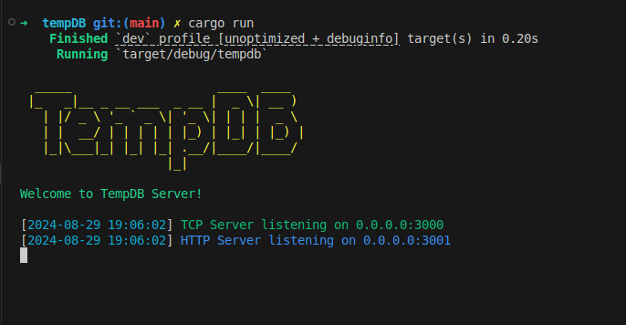

<h2 align="start">Temp-DB 💾</h1>
<h3 align="start">TempDB is a lightweight, in-memory key-value store with persistence capabilities, designed for temporary data storage and quick access.
</h3>
<p align="start">
    
</p>

## 🚀 Why TempDB?

TempDB has been created to provide a simple, fast, and flexible solution for temporary data storage needs. It's useful for:

- Caching frequently accessed data
- Storing session information
- Implementing rate limiting
- Prototype development and testing

## Libraries

This repo containes libraries for interacting with TempDB, with the listed languages.

### Golang

This is a Go client library for interacting with the TempDB server.

```sh
go get github.com/ThembinkosiThemba/tempdb-libs/go/lib
```

and a simple usage. Full usage documentaion will be available via this [file](./golang/test.go) or [this](./usage/usage.go).

```go
package main

import (
	"fmt"
	"log"

	tempdb "github.com/ThembinkosiThemba/tempdb-go/lib"
)

func main() {
	apiKey := os.Getenv("API_KEY")
	/// The NewCLient function initialises the client and takes 3 parameters
	/// 1. The address, either locally is ran there, or on a hosted client which is comming soon.
	/// 2. The database, this is the database you will be using to store data using the client.
	/// 3. Token, for access control, you will need to provide
	client, err := tempdb.NewClient("0.0.0.0:3000", "ecommerce-store", apiKey)
	if err != nil {
		log.Fatalf("Failed to get client: %v", err)
	}
	defer client.Close()

	// Example usage when storing product information
	response, err := client.SetJson("p:1", map[string]interface{}{
		"name":      "Laptop",
		"price":     999.99,
		"stock":     50,
		"Locations": "US",
	})
	if err != nil {
		log.Printf("Error setting user info: %v", err)
	} else {
		fmt.Println("Set user info response:", response)

	}

	// getting a particular product information
	getProductInfo, err := client.Get("p:1")
	if err != nil {
		log.Println("failed to get :", err)
	} else {
		log.Println("data: ", getProductInfo)
	}
}

```

### Javascripy

This is a JS client library for interacting with the TempDB server.

```sh
npm install tempdb-js
```

and a simple usage. Full usage documentaion will be available via this [file](./golang/test.go) or [this](./usage/usage.go).

```javascript
import TempDBClient from "tempdb-js";

async function main() {
  const apiKey = process.env.API_KEY;
  if (!apiKey) {
    console.error("API_KEY environment variable is not set");
    process.exit(1);
  }

  let client;
  try {
    // Initialize the client
    // Parameters:
    // 1. The address (either local or hosted)
    // 2. The database name
    // 3. The API key for access control
    client = new TempDBClient("0.0.0.0:3000", "ecommerce-store", apiKey);

    // Example usage when storing product information
    const productData = {
      name: "Laptop",
      price: 999.99,
      stock: 50,
      Locations: "US",
    };

    const setResponse = await client.setData("p:1", productData);
    console.log("Set product info response:", setResponse);

    // Getting a particular product information
    const getProductInfo = await client.get("p:1");
    console.log("Retrieved product info:", getProductInfo);
  } catch (error) {
    console.error("Error:", error.message);
  } finally {
    if (client) {
      client.close();
    }
  }
}

main();
```

### Python

This is a Python client library for interacting with the TempDB server.

```sh
pip install tempdb-py
```

and a simple usage. Full usage documentaion will be available via this [file](./python/usage/usage.py).

```sh
import os
from tempdb_py import TempDBClient

def main():
    api_key = os.getenv('API_KEY')
    if not api_key:
        print('API_KEY environment variable is not set')
        return

    client = TempDBClient('0.0.0.0:3000', 'ecommerce-store', api_key)

    try:
        # Example usage when storing product information
        product_data = {
            "name": "Laptop",
            "price": 999.99,
            "stock": 50,
            "Locations": "US"
        }

        set_response = client.set_data('p:1', product_data)
        print('Set product info response:', set_response)

        # Getting a particular product information
        get_product_info = client.get('p:1')
        print('Retrieved product info:', get_product_info)

    except Exception as e:
        print('Error:', str(e))

    finally:
        client.close()

if __name__ == '__main__':
    main()
```
