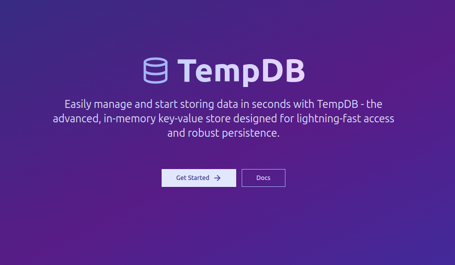

<h2 align="start">Temp-DB 💾</h1>
<h3 align="start">TempDB is a lightweight, in-memory key-value store with persistence capabilities, designed for temporary data storage and quick access.
</h3>

    

## 🚀 Why TempDB?

TempDB has been created to provide a simple, fast, and flexible solution for temporary data storage needs. It's useful for:

- Caching frequently accessed data
- Storing session information
- Implementing rate limiting
- Prototype development and testing

## Libraries

This repo containes libraries for interacting with TempDB, with the listed languages.

Clients can connect to the database using the available libraries for [Golang](https://docs.tempdb.xyz/golang), [Javascript](https://docs.tempdb.xyz/js) and [Python](https://docs.tempdb.xyz/python).